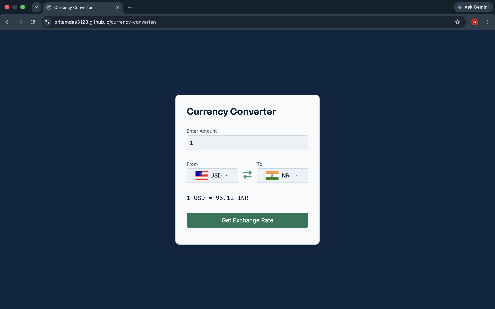
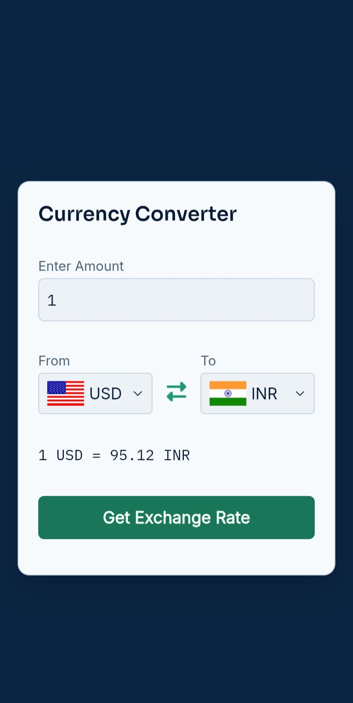

# Currency Converter

A real-time currency converter, built from scratch with vanilla HTML, CSS, and JavaScript — with no frameworks or libraries.

## Screenshots

| Desktop View | Mobile View |
|:---:|:---:|
|  |  |

## Features
- Live exchange rate conversion between 150+ world currencies
- Country flags update automatically based on the selected currency
- One-click swap between "From" and "To" currencies
- Primary + fallback API calls, so a single API outage doesn't break the app
- Input validation — defaults to a valid amount if the field is left empty or invalid
- Clear error messaging if a rate can't be fetched
- Fully responsive layout — usable on both desktop and mobile

## Built with


## Live Demo
**[pritamdas3123.github.io/currency-converter](https://pritamdas3123.github.io/currency-converter/)**

## How to Use
1. Enter an amount in the input field (defaults to 1).
2. Select the currency you're converting **from**, and the currency you're converting **to**.
3. Click the swap icon anytime to instantly reverse the two currencies.
4. Click "Get Exchange Rate" to see the converted amount.

## Run It Locally
```bash
git clone https://github.com/pritamdas3123/currency-converter.git
cd currency-converter
```
Then just open `index.html` in your browser — no build step, no dependencies, no installation required.

## Project Structure
```
currency-converter/
├── index.html               # Page structure and markup
├── style.css                # Styling, layout, and theming
├── app.js                   # Conversion logic, API calls, and event handling
├── country_code.js          # Currency-to-country code mapping (for flags)
├── screenshots/
│   ├── screenshot-desktop.png
│   └── screenshot-mobile.png
└── README.md
```

## Possible Future Improvements
- Cache recent exchange rates to reduce redundant API calls
- Historical rate chart for the selected currency pair
- Shareable conversion links via URL parameters

## Author
**Pritam Das**

[](https://github.com/pritamdas3123)
[](https://www.linkedin.com/in/pritamdas3123)
[](mailto:pritamdas3123@gmail.com)